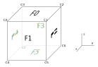

Cube Model Definition
=====================

Some information about the conventions used for defining the cube model (see
cube_model.hpp).

TODO: Add some references to the actual code?

Face and Corner Indices
-----------------------

The faces and corners of the cube are referenced by indices.  The figure blow
shows the positions of the faces (F0 to F5) and corners (C0 to C7) with respect
to the cube reference frame.

When accessing elements of a list that corresponds to the faces (e.g. the list
of face normal vectors), the i-th entry belongs to face "Fi".  Likewise for the
corners.

There origin of the cube reference frame is at the centre of the cube.

Mapping Colours to Faces
------------------------

The geometry of the cube is defined using only the generic face indices
described above.  In addition, there is a mapping of colour to face index.  This
way, it is relatively to adapt to new cubes where the order of colours are
different (e.g. cube version 1 has a different colour order as cube version 2).

By convention the colour-to-face mapping is done such that the following colours
are pointing in direction of the axes of the cube reference frame:

 - x: red
 - y: green
 - z: blue
