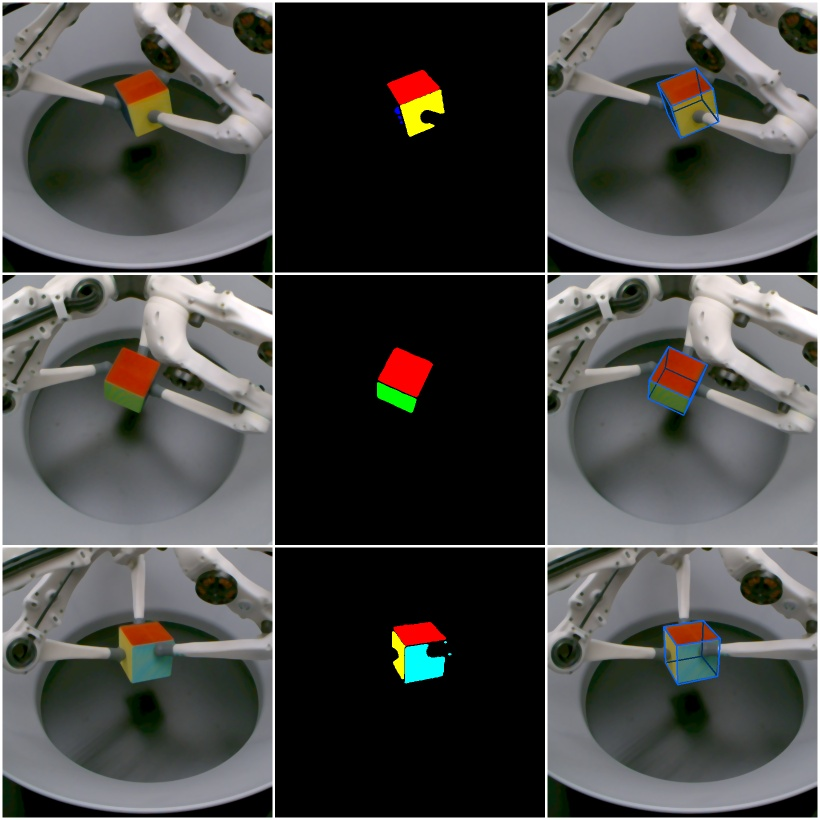

Multi-camera pose estimation of coloured cuboids for the TriFinger robots.

Detect coloured cuboids (with a different colour on each side) using images from
three cameras.  This is used for object detection in the TriFinger robot
platforms but could also be used in other settings with multiple cameras.

The source code is hosted on GitHub_.  Please also use the `Bug Tracker`_ there
if you have a question or want to report a bug.

.. toctree::
   :caption: General Documentation
   :maxdepth: 1

   doc/a1_introduction.rst
   doc/a2_cube_model.rst
   doc/b1_train_colour_segmentation.rst

.. _GitHub: https://github.com/open-dynamic-robot-initiative/trifinger_object_tracking
.. _Bug Tracker: https://github.com/open-dynamic-robot-initiative/trifinger_object_tracking/issues
